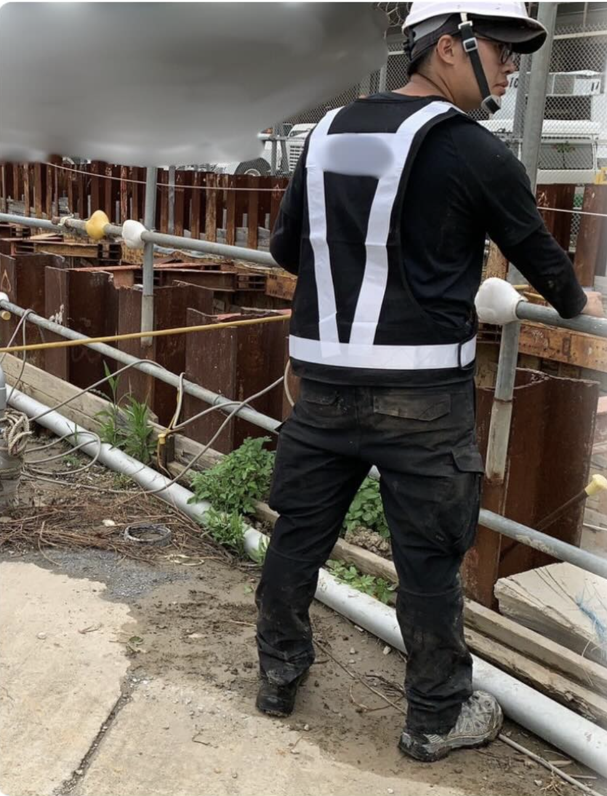

<!-- _class: title -->

# 如何讓你的公司
# **自己無腦運轉**

### 不靠昂貴 ERP，不靠你的肝

---

<!-- _class: center -->

## 你是這種人嗎？

---

## 你是不是…

- 員工產出品質每次不一樣，**SOP 形同虛設**，最後你親自擦屁股？

- 重要資料散落在 LINE 群、Google Drive、紙本，**要用的時候永遠找不到**？

- 想擴張版圖，卻**每天被內部混亂綁死**，連安心睡覺的時間都沒有？

---

<!-- _class: center -->

## 如果符合其中一種

# 你就**來對地方**了

這支影片就是為你拍攝的

---

<!-- _class: center -->

## 接下來 30 分鐘

# 我將告訴你 **3 個秘訣**

讓深陷「無效忙碌」的你
打造一套**會自己運轉的企業大腦**

---

## 3 大核心秘訣

**秘訣一：極效流程解構**
→ 不靠你的肝，打造真正防呆的 SOP

**秘訣二：Notion 企業中樞**
→ 找資料從 10 分鐘變成 1 秒鐘

**秘訣三：遊戲化策略 × AI**
→ 讓員工主動做事，讓顧客回頭率翻倍

---

<!-- _class: center -->

## 這不是你第一次嘗試解決了

# 但這次**不一樣**

花了整整一個月準備這支影片
為的是把最適合你的方法教給你

---

<!-- _class: gift -->

## 🎁 專屬驚喜

看到影片**第 10 分鐘**，畫面下方解鎖：

# 《標準化專案 Notion 模板》

### 免費領取，立刻建立你的第一套 SOP

---

<!-- _class: center -->

## 先等一下…

# 這個人說的話**可以信嗎？**

---

<!-- _class: img-right -->

## 我是 Ray

**企業營運系統設計師**

協助過：
- 營造業 / 製造業
- 中小企業 / 接案者
- 餐廳

把**傳統混亂的作業模式**
轉化為流暢的 Notion 數位化大腦

---

<!-- _class: img-right -->

## 我的起點

出身**營造業現場管理**

每天面對：
- 幾百個 LINE 訊息
- 滿滿的紙本表單
- 永遠不同步的 Excel

光是「找資料」就耗盡全隊精力
更別提**工程出包與預算黑洞**

---

## 公司砸了上百萬導入 ERP

結果？

- 系統僵化，現場人員根本不願意用
- 流程**更混亂**
- 成了最昂貴的**數位蚊子館**
- 每個月還要付驚人的維護費

---

<!-- _class: center -->

## 我決定拋棄昂貴罐頭軟體

# 用 **Notion** 從零打造
# 符合我們商業邏輯的系統

**結果：公司轉虧為盈**

---

<!-- _class: center -->

## 那一刻我才明白

# 阻礙企業盈利的
# 不是軟體**不夠貴**

而是缺乏一套
**貼合商業邏輯的核心架構**

---

<!-- _class: secret -->

# 秘訣一
# **極效流程解構**

打破 SOP 形同虛設的迷思

---

## 傳統 SOP 的死亡陷阱

舊觀念：把字寫下來 = SOP ✗

**遇到具體狀況 → 大家還是做錯**

**沒盯緊 → 出產品質大打折扣**

---

## 我研究了豐田式管理後發現…

真正有效的 SOP
不只告訴員工「**該做什麼**」

更重要的是
告訴他們「**為什麼要這樣做**」

---

<!-- ============================================
     📸 圖片三：豐田工廠或油漬示意圖
     → 請放入：images/toyota-case.jpg
     → 建議：工廠機器、技師工作的照片
     ============================================ -->

## 豐田的真實案例

技師在地上發現**一灘油漬**

一般員工：把油擦乾淨 ✓（表象）

豐田技師：連問 **5 個為什麼**

---

## 連問 5 個為什麼

1. 為什麼地上有油？→ 天花板滴油
2. 為什麼天花板滴油？→ 潤滑油漏了
3. 為什麼潤滑油漏？→ 墊圈磨損
4. 為什麼墊圈磨損？→ 保養未按計劃
5. 為什麼未按計劃？→ **沒有標準化流程**

---

<!-- _class: center -->

## 結果

# 不只解決了「地上的油」

# 而是**從根源**
# 讓同類問題**永遠不再發生**

---

## 極效流程解構的奧義

當新專案（或新客人）進來時
系統**自動展開**帶有「為什麼」的防呆清單

員工不再是機器人
而是了解全盤脈絡的**執行者**

---

<!-- _class: gift -->

## 🎁 你的模板解鎖了！

# 《標準化專案 Notion 模板》

畫面下方的按鈕已解鎖

**免費領取，立刻建立你的第一套防呆 SOP**

---

<!-- _class: secret -->

# 秘訣二
# **Notion 企業中樞**

解決資料黑洞與內部抗拒

---

## 你可能有這個困擾…

「我們公司也試過 Notion 或各種軟體，
但最後**只有我一個人在用**。」

---

<!-- _class: center -->

## 為什麼員工不愛用？

# 因為你給他們的是
# 一個**增加工作量**的軟體

不是一個**幫他們省麻煩**的系統

---

<!-- ============================================
     📸 圖片四：Notion 資料庫截圖（before/after）
     → 請放入：images/notion-demo.jpg
     → 建議：你實際建好的 Notion 系統截圖
     ============================================ -->

## 關聯資料庫的威力

把**客戶名單、合約、任務進度**全部打通

找資料：
~~10 分鐘~~ → **1 秒鐘**

只要做對一次
大家**根本離不開這個系統**

---

<!-- _class: secret -->

# 秘訣三
# **遊戲化策略 × AI**

無痛解決留客率與擴張恐懼

---

## 你可能會說…

「我的行業很特殊，這套方法**適合我嗎**？」

「我不懂技術，AI 這些**離我太遙遠了**。」

---

## 遊戲化策略

面對客戶、需要管理回購的產業
可以在系統裡設計**遊戲化機制**

- 員工完成任務 → **自動累積績效紀錄**
- 客戶服務流程 → **破關式進度追蹤**
- 月底一鍵產出報告，**老闆不用再問進度**

→ **員工主動做，顧客持續回頭**

---

## 關於 AI

你**根本不需要會寫程式**

架構建好後，AI 就是大腦的助手
自動摘要、自動分類

你缺的不是技術跟人員
你缺的只是一套
**能落地執行的中樞大腦架構**

---

<!-- _class: center -->

## 快速複習 3 大秘訣

**秘訣一：防呆流程** 取代失效的文字 SOP

**秘訣二：Notion 關聯資料庫** 消滅資料黑洞

**秘訣三：遊戲化 × AI** 讓員工動起來，留住顧客

---

<!-- _class: center -->

## 想像一下…

如果你的企業**明天也開始用這套模式運轉**

你還會把自己累垮在
無效的溝通與行政瑣事上嗎？

---

<!-- _class: secret -->

# 真實案例 #1
# **營造業**

---

## 營造業｜導入前的痛點

**老闆說：「不管怎麼管，都很難落實到員工身上。」**

- 工地進度散落在幾百個 **LINE 訊息**
- 人力、材料、支出全靠**紙本表單**記錄
- 成本控制與員工管理**各說各話**
- 老闆只能靠「親自盯」才能掌握現場狀況

---

## 營造業｜導入後的成果

建立 Notion 工程管理系統 × AI 資源分析

- 工地主任每天只需：**填人數 + 費用 + 照片**，就可以下班
- 材料、人力、時間流向**一鍵可查**
- AI 後端分析找出**可節省的資源空間**
- 老闆不再親自跳下來，由系統**自動彙整回報**

**→ 員工願意用了，老闆終於能抬頭看戰略**

---

<!-- _class: secret -->

# 真實案例 #2
# **法律事務所**

---

## 法律事務所｜導入前的痛點

**「案子進來之後，沒有人能一路追到結案。」**

- 合約在 Word、掃描檔在資料夾、**開會紀錄散在各處**
- 每個人各做各的，**前段做了什麼，後段不知道**
- 人一少，事情就斷
- 收款時間、案件狀態**全靠單一行政人員記在腦子裡**

---

## 法律事務所｜導入後的成果

建立 Notion 案件管理系統 × 老闆看板

- 開案 → 進行 → 產出 → 結案，**標準流程一條線走到底**
- 老闆打開手機 **30 秒內看懂全公司狀況**
- 所有文件、合約、會議紀錄**全部集中在案件底下**
- 不再依賴單一行政人員，**新人進來也知道怎麼做**

**→ 制度跑起來了，老闆不用盯，錢不會漏**

---

<!-- _class: center -->

## 但我知道你心裡有個聲音…

---

<!-- _class: center -->

## 「這聽起來很棒，
## 但我哪有**空去研究 Notion**？」

---

## 你說得對

你的強項是你的**專業與市場**
不是每天對著軟體空白頁面發呆

你比過去瞎摸索的老闆幸運
因為這條彎路，**我可以直接幫你鋪好**

---

<!-- _class: center -->

# 【專屬企業營運大腦】
# 客製化系統建置 × 陪跑服務

---

## 這項服務的目標只有一個

以你公司的**商業模式為核心**
量身打造、親手建置 Notion 運轉系統

即便你**完全不懂軟體、不懂 AI**，也毫無影響

---

## 服務包含

✅ 深入挖掘你的**商業斷點**

✅ 系統架構**客製化建置**

✅ 內部員工**教育與系統移轉**

不只給你模板，而是
**一勞永逸解決你的混亂**

---

## 這不是線上課程

坊間客製化開發：**幾十萬～上百萬台幣**
後續還有高昂維護費

透過 Notion × 我的模組化方法：
- **省下極大開發成本**
- **保有未來轉型的高度彈性**

---

## 一年陪跑，我們做什麼？

**企業大腦建置（Notion）**
- 客製化管理系統、資料庫、老闆看板
- 防呆 SOP 流程化、員工導入

**AI 工作流串接**
- 依你的產業設計 AI 自動化流程
- 讓系統幫你處理重複性工作

**持續優化陪跑**
- 每月 1-2 次線上會議，根據實際使用調整
- AI 技術持續更新，系統跟著進化

---

## 一年的時間軸

**第 1-3 個月：建置期**
→ 完成核心系統 90%，員工開始上手

**第 4-12 個月：優化期**
→ 根據實際使用持續調整
→ 串接更多 AI 工作流
→ 每月陪跑會議不中斷

**合約到期後**
→ 系統**永遠屬於你**，不會消失
→ 可選擇續約繼續優化，或獨立運作

---

## 你的產業不在上面？

簡報裡提到的只是**部分案例**

只要你的公司有以下任一問題：

- 資料散落、找不到東西
- 流程靠人記、靠人盯
- 想導入 AI 工作流但不知從哪開始

**不管什麼產業，都歡迎在諮詢時提出來**
我們一起評估你的情況是否適合

---

<!-- _class: center -->

## 你加入之後，完整獲得的是

---

## 核心服務

✅ 營運系統健檢 + 架構設計 ⋯⋯⋯ **NT$30,000**
✅ Notion 企業資料庫客製建置 ⋯⋯ **NT$60,000**
✅ 防呆 SOP 流程化 ⋯⋯⋯⋯⋯⋯⋯ **NT$30,000**
✅ 員工導入培訓 ⋯⋯⋯⋯⋯⋯⋯⋯ **NT$20,000**

---

## 額外獲得

🎁 每月 1-2 次線上陪跑會議 ⋯⋯⋯ **NT$20,000**
🎁 Notion 一對一教育訓練 ⋯⋯⋯⋯ **NT$15,000**
🎁 AI 工具應用一對一教育訓練 ⋯⋯ **NT$15,000**
🎁 Notion × AI 課程永久觀看資格 ⋯ **NT$9,800**
&nbsp;&nbsp;&nbsp;&nbsp;&nbsp;（目前錄製中，會員限定免費）

  以上服務市場總價值 
  NT$199,800

---

## 總價值 vs 你今天的投資

~~傳統 ERP 客製開發：NT$500,000 起~~

~~市場總價值：NT$199,800~~

# 一整年：只要 **NT$60,000**

**🎁 今天預約諮詢，享有限定優惠**
優惠內容於諮詢當天揭曉，**僅限今日預約**

---

<!-- _class: center -->

## 換個角度想

一整年 **NT$60,000**

等於每天不到 **NT$165**

你花這個錢，換來的是一套
**讓公司不靠你也能運轉的系統**

具體的付款方式，
我們在**諮詢當天**一起討論

---

<!-- _class: gift -->

## 🎁 限時加碼

預約健檢諮詢後，若確認合作

**啟動費享有一次性專屬優惠**

金額在諮詢當天當面告知
（非公開優惠，僅限本次諮詢）

---

<!-- _class: center -->

# 今天你需要做的只有一件事：
# **預約免費 45 分鐘健檢**

---

<!-- _class: center -->

## 免費一對一
# **營運系統健檢諮詢**
### 45 分鐘，完全免費

分析你的**營運痛點** ✦ 勾勒你的**系統藍圖** ✦ 確認契合才報價

**不適合？帶走優化建議，零壓力**

---

<!-- _class: center -->

## 保證

如果 45 分鐘結束後你覺得毫無收穫

我給你一份價值 **NT$5,000**
的系統健檢報告作為補償

不需要任何理由

---

## 你現在有兩個選擇

**選擇一：** 關掉影片
繼續回到 SOP 無效、每天擦屁股的生活

**選擇二：** 點擊下方按鈕
用 45 分鐘換取事業**可規模化擴張**的機會

---

<!-- _class: urgent -->

## ⚠️ 現在加入，才是最低價

- 服務費用**只會越來越貴**，隨內容升級同步調漲
- 每個月只接受 **5 位**客戶預約
- 名額滿了，表單**自動關閉**

**現在是你能用最低價格獲得完整服務的時機**

---

<!-- _class: cta -->

# 現在就點擊下方按鈕

# **會議室見！**

### 預約免費 45 分鐘營運系統健檢

---

<!-- _class: center -->

## Q&A（1/3）

**Q：系統建好之後，我自己維護得了嗎？**
A：可以。前三個月建置期我會手把手帶你跑，
同時教你和員工怎麼用。
一年陪跑期間，有任何問題每月會議都可以調整。
合約到期後，系統完全屬於你，不需要依賴我。

---

<!-- _class: center -->

**Q：員工如果不願意配合怎麼辦？**
A：我們的核心原則是**不改變員工習慣，讓系統配合人**。
負擔越低，配合意願越高。

**Q：我不懂 AI 和 Notion，真的適合嗎？**
A：完全不需要你懂。
你只需要告訴我業務流程，**技術由我來處理**。

---

<!-- _class: center -->

**Q：費用怎麼計算？合約到期後還要繼續付費嗎？**
A：費用與付款方式會在**諮詢當天**詳細說明。
合約到期後系統**永遠屬於你**，不需要繼續付費。
如希望繼續優化陪跑，可選擇續約。

**Q：如果諮詢後覺得不適合，會有壓力嗎？**
A：完全沒有。雙方確認契合才進入合作。
不適合就帶走優化建議，**不收任何費用**。
